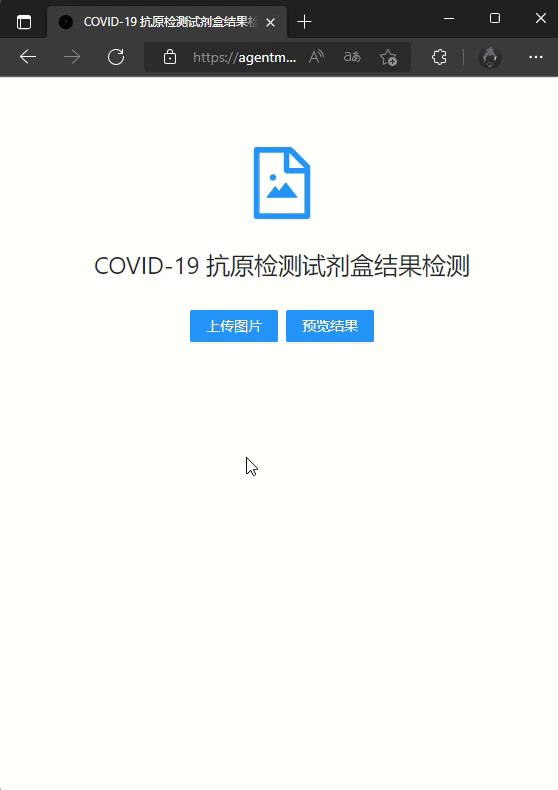

# COVID-19_Antigen_Test_Kit_Detection
## 简介
* 基于新冠肺炎抗原快速检测试剂盒图像的结果检测

## 演示
* 本项目已部署至 [Github Page](https://agentmaker.github.io/COVID-19_Antigen_Test_Kit_Detection/) 中，可以直接在线访问进行试用体验

* 由于网络因素影响，加载模型的耗时可能会比较长（几分钟），请耐心等待

* 网页效果如下图所示：

    